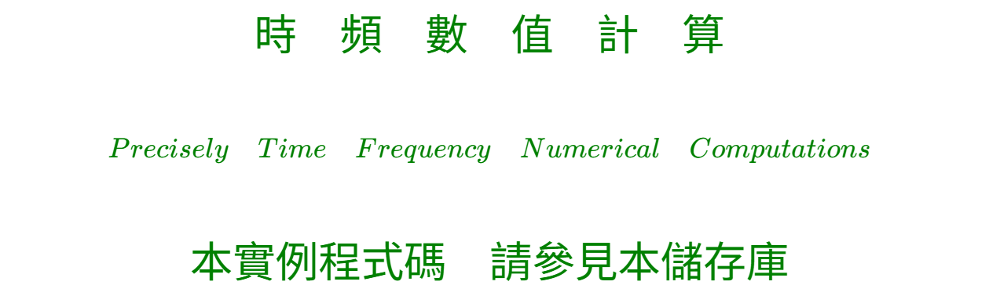
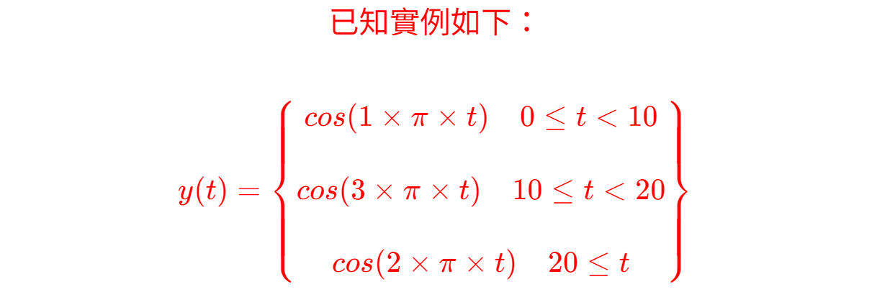
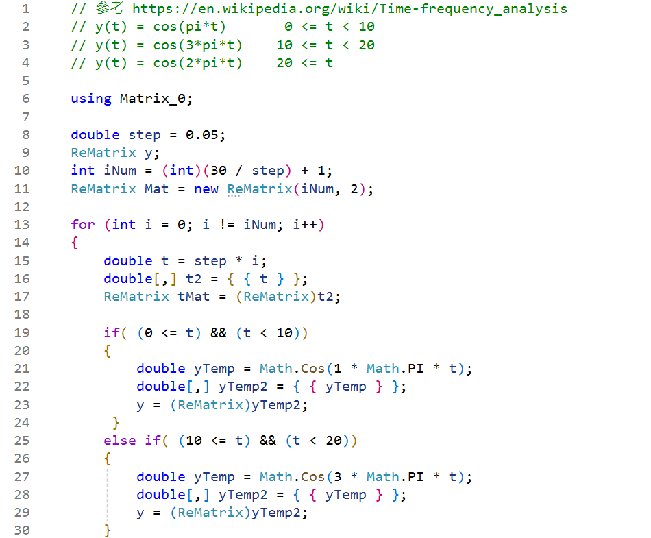
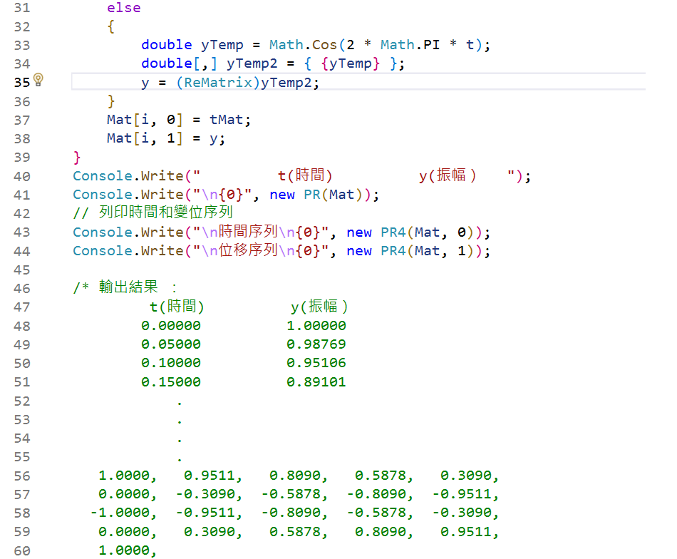

<!--     範例 App_50        -->

<!-- 
# \[{  \color{Fuchsia}精\;銳\; \color{Purple}矩\;陣\;  \color{Red}計\;算\; \color{Green} 求\;解\;器  }\] 
-->  
 

<!--         
#### \[{  \color{Fuchsia} 【 \color{Green}  Sharp \; Matrix \; Solver \;  \color{Brown} \iff  \;  \color{Red} S\;M\;S】 }\]  
-->  
  

---

<!--   
## \[{ \color{Fuchsia} Time-Frequency-Signal \;(Response) \quad Solution  }\] 
-->
  

<!--     ##### \[ using \]   -->
  

<!--   
## \[  \color{Red} Precisely \; Numerical \; Value \; Computations  \]  
-->  
  

<!--     ##### \[ with \]   -->  
  

<!--   
## \[{ \color{Green} Real \; \color{Red} And \; \color{magenta} Complex \quad \; \color{Brown} Matrix \;\; Transform  }\] 
-->
  

<!--         ##### \[ Part \; 1 \]    -->  
<!--         -->  
<!--   ##### $$Part \quad 2$$   -->  

####  

---
<!--  
# \[ \color{Green} 時\quad頻\quad數\quad值\quad計\quad算 \]  
### \[ \color{Green} Precisely \quad Time \quad Frequency \quad Numerical \quad Computations \]  
-->


<!--      
#########################################################

#  $ 微分方程式 : $

### $$ M(t) \times \ddot{y}_h(t) + C(t) \times \dot{y}_h(t) + K(t) \times y_h(t) = d_h $$  

## $$ 由齊次微分方程式，得到\quad \ddot{y}_h(t)、\dot{y}_h(t)、y_h(t) $$  

### $$ M(t) \times \ddot{y}_p(t) + C(t) \times \dot{y}_p(t) + K(t) \times y_p(t) = f(t) $$  

## $$ 由非齊次微分方程式，得到\quad \ddot{y}_p(t)、\dot{y}_p(t)、y_p(t) $$   

## $通解 ：$ 

##  $$\begin{bmatrix}\dot{y}(t)\\y(t)\end{bmatrix} =\begin{bmatrix}\dot{y}_h(t)\\y_h(t)\end{bmatrix} + \begin{bmatrix}\dot{y}_p(t)\\y_p(t)\end{bmatrix}$$

---  

>  ***空間多自由度、且多階的時間函數、齊次微分方程式：M(t) * yh''(t) + C(t) * yh'(t) + K(t) * yh(t) = dh，使用友矩陣(Companion Matrix)的方法，求得系統或狀態矩陣 A(t)，再求得 A(t) * Q(t) = Q(t) * D(t)，其中Q（t）是特徵向量矩陣，D（t）是特徵值矩陣，稱此法為實數與複數矩陣轉換（ Real And Complex Matrix Transform ），本求解法可對應於 Laplace、 Fourier、 Z Transform 或是捲積積分法等等。隨時間變化的角頻率（$\omega$）是系統矩陣 A（t）之複數特徵值的虛數值，隨時間變化的模態，是系統矩陣 A（t）的特徵向量。D（t）和Q（t）為系統的潛在特性，並在系統受到外力時，才會顯現出來。若要求得系統的訊號響應值[Signal Response]，應由實際量測的初始值或是邊界值，求得複數係數向量$d_h$，再依據如下推導的公式求得。有關初始值和邊界值分別參見App_6J和App_6M儲存庫，而相關的推導公式如右，$\begin{bmatrix}y_h'(t)\\y_h(t)\end{bmatrix} = H_{exp}(D,Q,t) \times d_h$，其中$D$為複數特徵值矩陣，$Q$為複數特徵向量矩陣（模態），$Q_i$為$Q$之逆矩陣，$Hexp(D, Q, t)$和$d_h$分別爲複數矩陣和複數向量。***   

#  $$實 \quad 例 \quad 計 \quad 算 \quad : $$

### $$詳細的【CSharp】程式碼和輸出圖表，請參考本儲存庫中的檔案$$ 

##

$ \color{red} M(t) = \begin{bmatrix} 19 & -1.5 & -2+13.3\times sin(0.85 \times t) \\ -1 & 15 & 0 \\ -10-2.7 \times cos(1.3 \times t) & -3 & 27 \end{bmatrix}$  
 
###

$ \color{red} K(t) = \begin{bmatrix} 60 & -8 & -2-332 \times sin(1.37 \times t) \\ -16 & 180 & -120 \\ -20 & -100+579 \times cos(0.24 \times t) & 300 \end{bmatrix}$

###

$ \color{red} C(t) = \begin{bmatrix} 35 & -1-13.2 \times sin(0.35 \times t) & -0.5 \\ -1.5 & 40 & -1.5 \\-1.2+22.5 \times cos(1.95 \times t) & -1.5 & 75 \end{bmatrix} $

#    

### $A(t) = \begin{bmatrix} -M_i(t) \times C(t) & -M_i(t) \times K(t) \\ I & O \end{bmatrix}$

###  $A(t) \times Q(t) = Q(t) \times D(t) \quad  => \quad A(t) = Q(t) \times D(t) \times Q_i(t)$  

### $ \begin{bmatrix} \ddot{y}_h(t) \\ \dot{y}_h(t) \end{bmatrix} = A(t) \times \begin{bmatrix} \dot{y}_h(t) \\ y_h(t) \end{bmatrix} $

### $ \begin{bmatrix} \dot{y}_h(t) \\ y_h(t) \end{bmatrix} = H_{exp}(D, Q, t)  \times d $

### $ \begin{bmatrix} \dot{y}(t) \\ y(t) \end{bmatrix} = \begin{bmatrix} \dot{y}_h(t) \\ y_h(t) \end{bmatrix} + \begin{bmatrix} \dot{y}_p(t) \\ y_p(t) \end{bmatrix} $

##  

--- 

# 本人初淺的見解如下 ： 

### **時頻數值計算，因爲每一段時間（可能是一秒或是千分之一秒或是百萬之一秒），系統都在變動，也就是相對的頻率都在變動。** 

### **實際時頻數值計算，必須使用程式碼，才有可能計算出來，使用手算幾乎不可能。**  

### **分析（Analysis）包含轉換（Transform）是方法的闡釋，但最後的目標應是實際精確的數值計算結果。**

###  **動態系統的數值計算，輸入的數據應是實數，輸出的結果也應該是實數，要得到【精確的數值】，中間的運算過程，可能必須使用複數矩陣的計算，此部分也是使人產生困惑的地方，故【從古至今，複數矩陣的數學理論，似乎無法處理此問題，唯有使用程式碼，並作實際的計算來解決】。** 

##

---  

#####################################################################################
-->

<!--   
## \[ \color{Red}已知實例如下 ：\]  

## \[  \color{Red} y(t) = \begin{Bmatrix} cos(1 \times \pi \times t ) \quad 0 \leq t < 10 \\\\ cos(3 \times \pi \times t) \quad 10 \leq t < 20  \\\\ cos(2 \times \pi \times t) \quad 20 \leq t  \end{Bmatrix}  \]  
-->


---

## [參見 https://en.wikipedia.org/wiki/Time-frequency_analysis](https://en.wikipedia.org/wiki/Time-frequency_analysis)


<!--    
# \[ \color{Brown}結 \qquad 論 \qquad 如 \qquad 下 ：\]  
-->


### **1. y是輸出響應值。** 

### **2. 已知角頻率分別是 1 X Pi，3 X Pi，和 2 X Pi，故不是好的時頻，數值計算的實例。**

### **3. 參見App_48儲存庫，由微分方程式，求得實數系統矩陣A，再求得複數特徵矩陣D，和複數模態矩陣Q。**  

### **4. 複數特徵值矩陣的虛數部分即角頻率。**  

### **5. 使用Hexp(D, Q, t)轉換矩陣可求得實數的響應值，參見Hexp(D, Q, d)的推導、求取係數向量d、和CSharp程式碼。**

### **6. 多個不同狀態變數的響應值，參見 App_6J ... App_48 儲存庫中的程式碼。**

---

 






```C#
// 參考 https://en.wikipedia.org/wiki/Time-frequency_analysis 
// y(t) = cos(pi*t)       0 <= t < 10 
// y(t) = cos(3*pi*t)    10 <= t < 20 
// y(t) = cos(2*pi*t)    20 <= t 

using Matrix_0; 

double step = 0.05;
ReMatrix y;
int iNum = (int)(30 / step) + 1;
ReMatrix Mat = new ReMatrix(iNum, 2);

for (int i = 0; i != iNum; i++)
{
    double t = step * i;
    double[,] t2 = { { t } };
    ReMatrix tMat = (ReMatrix)t2;

    if( (0 <= t) && (t < 10))
    { 
        double yTemp = Math.Cos(1 * Math.PI * t);
        double[,] yTemp2 = { { yTemp } };
        y = (ReMatrix)yTemp2; 
     }
    else if( (10 <= t) && (t < 20))
    { 
        double yTemp = Math.Cos(3 * Math.PI * t);
        double[,] yTemp2 = { { yTemp } };
        y = (ReMatrix)yTemp2; 
    }
    else
    {  
        double yTemp = Math.Cos(2 * Math.PI * t);
        double[,] yTemp2 = { {yTemp} };
        y = (ReMatrix)yTemp2; 
    }
    Mat[i, 0] = tMat;
    Mat[i, 1] = y;
}
Console.Write("         t(時間)          y(振幅）   ");
Console.Write("\n{0}", new PR(Mat));
// 列印時間和變位序列 
Console.Write("\n時間序列\n{0}", new PR4(Mat, 0));
Console.Write("\n位移序列\n{0}", new PR4(Mat, 1));

/* 輸出結果 ：
         t(時間)          y(振幅）
        0.00000          1.00000
        0.05000          0.98769
        0.10000          0.95106
        0.15000          0.89101
            .
            .
            .
            .
   1.0000,   0.9511,   0.8090,   0.5878,   0.3090,
   0.0000,  -0.3090,  -0.5878,  -0.8090,  -0.9511,
  -1.0000,  -0.9511,  -0.8090,  -0.5878,  -0.3090,
   0.0000,   0.3090,   0.5878,   0.8090,   0.9511,
   1.0000,
*/
```
<!--  
## \[ \color{Fuchsia} \ast \quad \ast \quad \ast \quad \ast \quad \ast \quad \ast \quad \ast \quad \ast \quad \ast \quad \ast \quad \ast  \]
-->


  
